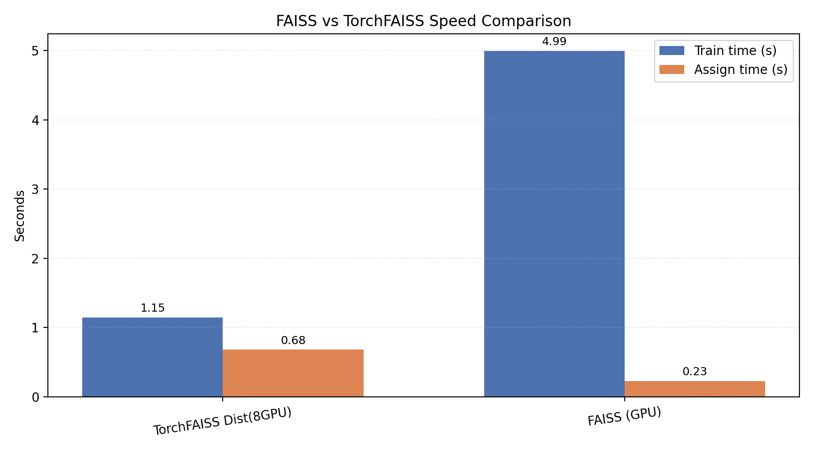
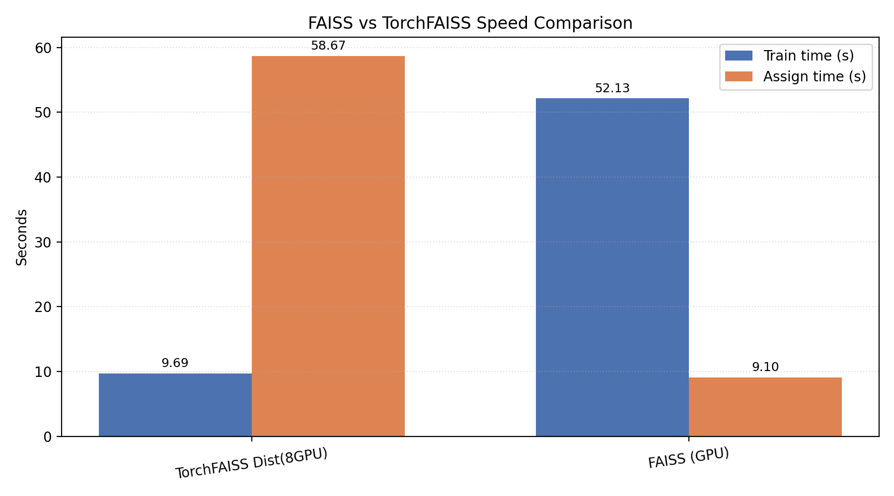
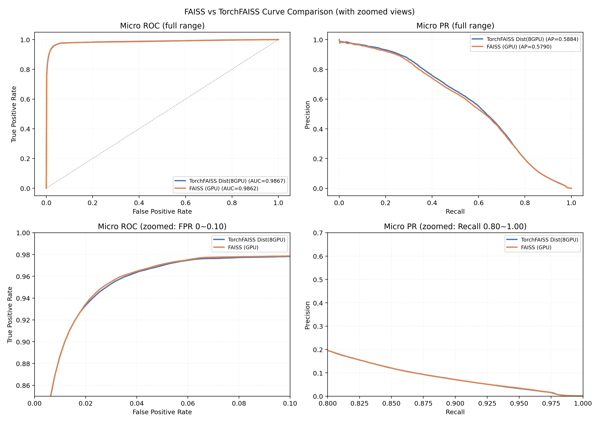
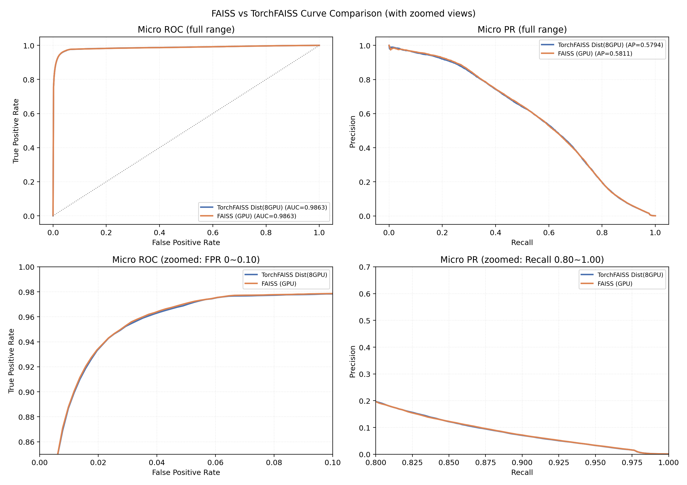

# TorchFAISS

<p align="center">
  
</p>

Pure PyTorch distributed KMeans implementation with a FAISS-compatible API (`train` / `assign` / `centroids`) and multi-GPU / multi-node training via `torch.distributed`.

GitHub Pages: https://anxiangsir.github.io/torchfaiss/

## Features

- FAISS-compatible API for fast migration
- Data-parallel distributed training with NCCL all-reduce
- Streaming assignment for large datasets
- Optional 20× scaled benchmark workflow
- Rich post-hoc evaluation against original IN1K labels (P/R/F1, ROC/PR, confusion matrix, cluster diagnostics)

## Installation

```bash
pip install -r requirements.txt
```

Install directly from GitHub (pip install git+):

```bash
pip install "git+https://github.com/anxiangsir/torchfaiss.git"

# if your environment uses a restricted mirror, use:
pip install --no-build-isolation "git+https://github.com/anxiangsir/torchfaiss.git"
```

Install a specific branch/tag/commit:

```bash
# branch
pip install "git+https://github.com/anxiangsir/torchfaiss.git@main"

# tag
pip install "git+https://github.com/anxiangsir/torchfaiss.git@v0.1.0"

# commit
pip install "git+https://github.com/anxiangsir/torchfaiss.git@<commit_sha>"
```

> Note: editable install (`pip install -e .`) depends on newer build-backend support in your pip/setuptools environment. Standard install (`pip install .`) and wheel install work reliably.

Build and install wheel (.whl):

```bash
python -m pip install --upgrade build
python -m build --no-isolation

# install built wheel
pip install dist/torchfaiss-0.1.0-py3-none-any.whl
```

## Quick Start

```python
from torchfaiss import TorchKmeans

km = TorchKmeans(d=768, k=1000, niter=20, gpu=True, verbose=True)
km.train(x_train)
D, I = km.assign(x_test)
```

Distributed:

```python
import torch.distributed as dist
from torchfaiss import TorchKmeans

dist.init_process_group(backend="nccl")
km = TorchKmeans(d=768, k=1000, niter=20, distributed=True, verbose=True)
km.train(x_local_shard)
D, I = km.assign(x_test)
```

BF16 (optional, CUDA device must support BF16):

```python
km = TorchKmeans(d=768, k=1000, niter=20, distributed=True, bf16=True)
```

`bf16=True` uses BF16 for the distance matmul hot path and keeps accumulations/objective in FP32 for stability.

## Why TorchFAISS Is Faster Than FAISS Here

For this benchmark setup, the speedup comes mainly from **data parallelism over training points** in Lloyd iterations:

1. **Assignment/update compute is split across GPUs**. Each rank handles ~N/world_size samples, so most O(N·K·d) work scales with GPU count.
2. **Per-iteration communication is relatively small**. Synchronization is over centroid statistics (roughly O(K·d)), while local distance compute stays O(N·K·d); as N grows, compute dominates and communication overhead is amortized.
3. **Better scaling at larger N**. In this repo’s results, speedup rises from **4.3× (1× data)** to **5.4× (20× data)**, which is consistent with distributed overhead becoming less significant at larger dataset sizes.
4. **Where speedup is not guaranteed**: for small datasets or communication-heavy settings, distributed overhead can offset gains.

In short: the benchmark is compute-heavy enough that splitting samples across GPUs yields substantial training-time gains while maintaining similar clustering quality.

## TorchFAISS Design Philosophy

TorchFAISS is designed around three principles:

1. **FAISS-compatible surface, PyTorch-native internals**
   - Keep migration cost low (`train/assign/centroids` interface)
   - Use pure PyTorch + `torch.distributed`, no custom C++/CUDA extension burden

2. **Scale-first KMeans implementation**
   - Treat assignment as the dominant O(N·K·d) workload
   - Prioritize sharding, batched compute, and communication-efficient centroid updates

3. **Performance with numerical stability**
   - Support optional BF16 in matmul hot path for speed
   - Keep key accumulations/objective paths in FP32 for stable convergence behavior

## Optimization Techniques in This Repo

- **Distributed data-parallel Lloyd iterations**: each rank computes local assignment/statistics, then all-reduce for centroid updates.
- **Batched nearest-centroid assignment**: avoids OOM and keeps GPU compute saturated.
- **Distance identity optimization** (`||x-c||^2 = ||x||^2 - 2x·c + ||c||^2`): reduces redundant compute.
- **Streaming assignment for large datasets**: chunk-based assignment on full train/val for 20× scale.
- **Empty-cluster repair strategy**: split-largest-cluster style fallback to keep K fixed and training stable.
- **Optional BF16 hot-path acceleration**: faster centroid-distance matmul when hardware supports BF16.
- **Portable path defaults**: scripts default to repo-relative paths for reproducibility across machines.

## Benchmark Summary

### 1× ImageNet Features

| Method | Train Time | Speedup vs FAISS |
|---|---:|---:|
| FAISS (GPU) | 4.99 s | 1.0× |
| TorchFAISS (8GPU) | 1.15 s | 4.3× |

### 20× ImageNet Features

| Method | Train Time | Speedup vs FAISS |
|---|---:|---:|
| FAISS (GPU) | 52.13 s | 1.0× |
| TorchFAISS (8GPU) | 9.69 s | 5.4× |

## Enhanced Evaluation vs Original IN1K Labels

`compare_results.py` now evaluates saved clustering outputs against original IN1K labels and generates:

- Clustering metrics: NMI, AMI, ARI, Rand, Fowlkes-Mallows, homogeneity, completeness, V-measure, purity
- Classification-style metrics from cluster→label mapping: accuracy, precision/recall/F1 (macro/micro/weighted), top-1/top-5
- Curves: one-vs-rest ROC and PR (micro/macro + top classes)
- Figures: confusion matrix (top classes), cluster size curve, cluster purity histogram

Run:

```bash
python compare_results.py --result_dir ./results
python compare_results.py --result_dir ./results_20x
```

Artifacts are saved under:

- `results/evaluation_reports/`
- `results_20x/evaluation_reports/`

### Speed Comparison Figures

1× dataset:



20× dataset:



### Unified FAISS vs TorchFAISS Curve Comparison (same figure)

The comparison image now includes both **full-range** and **zoomed** panels (low-FPR ROC and high-recall PR) so small quality gaps are easier to see.

1× dataset:



20× dataset:



## Reproducing the Full Pipeline

```bash
# 1) Extract CLIP features (set your ImageNet root)
torchrun --nproc_per_node=8 extract_features.py --data_root ./imagenet --output_dir ./features

# 2) Build 20× scaled dataset
python create_20x_features.py --src_dir ./features --dst_dir ./features_20x --scale 20

# 3) TorchFAISS benchmarks
torchrun --nproc_per_node=8 benchmark.py --feature_dir ./features --result_dir ./results
torchrun --nproc_per_node=8 benchmark_20x.py --feature_dir ./features_20x --result_dir ./results_20x

# optional BF16 speed mode
torchrun --nproc_per_node=8 benchmark.py --feature_dir ./features --result_dir ./results --bf16
torchrun --nproc_per_node=8 benchmark_20x.py --feature_dir ./features_20x --result_dir ./results_20x --bf16

# 4) FAISS benchmarks (run in env with faiss installed)
python benchmark_faiss.py --feature_dir ./features --result_dir ./results
python benchmark_faiss_20x.py --feature_dir ./features_20x --result_dir ./results_20x

# 5) Enhanced comparison + plotting
python compare_results.py --result_dir ./results
python compare_results.py --result_dir ./results_20x
```

## Project Structure

```text
torchfaiss/
├── torchfaiss/
│   ├── __init__.py
│   └── kmeans.py
├── extract_features.py
├── create_20x_features.py
├── benchmark.py
├── benchmark_faiss.py
├── benchmark_20x.py
├── benchmark_faiss_20x.py
├── compare_results.py
├── eval_utils.py
├── requirements.txt
└── README.md
```

## Citation

If you use this project in academic work, please cite:

```bibtex
@software{anxiangsir_torchfaiss_2026,
  author  = {anxiangsir},
  title   = {TorchFAISS: Pure PyTorch Distributed KMeans with a FAISS-Compatible API},
  year    = {2026},
  url     = {https://github.com/anxiangsir/torchfaiss}
}
```
